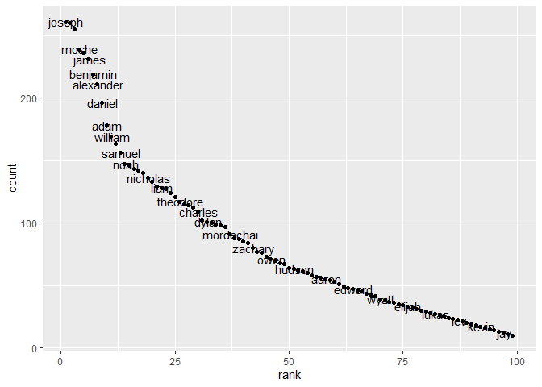

P8105\_hw2\_PaulinaHan
================
Paulina Han
2021/10/1

# Problem 1

``` r
trash_df = read_excel("./data/Trash-Wheel-Collection-Totals-7-2020-2.xlsx", sheet = "Mr. Trash Wheel", range = cell_cols("A:N")) 

#tidying trash data set
trash_tidy = 
  trash_df %>% 
  janitor::clean_names() %>% 
  drop_na(dumpster) %>% 
  rename(weight = weight_tons, volume = volume_cubic_yards) %>% 
  mutate(sports_balls = round(sports_balls,0))

#2019 precipitation
precipitation19_df = read_excel("./data/Trash-Wheel-Collection-Totals-7-2020-2.xlsx",sheet = "2019 Precipitation", range = "A2:B14")

#tidy 2019 precipitation data
tidy_2019_df =
  precipitation19_df %>% 
  janitor::clean_names() %>% 
  drop_na(total) %>% 
  mutate(year = 2019)
  
#2018 precipitation
precipitation18_df = read_excel("./data/Trash-Wheel-Collection-Totals-7-2020-2.xlsx",sheet = "2018 Precipitation", range = "A2:B14")

#tidy 2018 precipitation data
tidy_2018_df =
  precipitation18_df %>% 
  janitor::clean_names() %>% 
  drop_na(total) %>% 
  mutate(year = 2018)  

#combine precipitation data set
precipitation = 
  bind_rows(tidy_2018_df, tidy_2019_df) %>% 
 mutate(month = month.name[month])

#description 
#data set 1
ncol_trash_tidy = ncol(trash_tidy)
nrow_trash_tidy = nrow(trash_tidy)

mean_weight = mean(pull(trash_tidy, weight))
max_weight = max(pull(trash_tidy, weight))
min_weight = min(pull(trash_tidy, weight))

mean_volume = mean(pull(trash_tidy, volume))
max_volume = max(pull(trash_tidy, volume))
min_volume = min(pull(trash_tidy, volume))

#data set 2
ncol_precipitation = ncol(precipitation)
nrow_precipitation = nrow(precipitation)

max_rain = max(pull(precipitation, total))

#median of sports ball in 2019
ball =
  trash_tidy %>% 
  filter(year == 2019) %>% 
  pull(sports_balls) %>% 
  median()

#total precipitation in 2018
sum_2018 = precipitation %>% 
  filter(year == '2018') %>% 
  pull(total) %>% 
  sum()
```

The tidied Mr.Wheel Trash data set has 14 columns and 454 observations.
The mean weight of trash the dumpster took is 6.3863436 and the maximum
weight of trash the dumpster took is 1449.7, the minimum weight of trash
the dumpster took is 0.78. The mean volume of trash the dumpster took is
30.7577093, the maximum volume of trash the dumpster took is 6982 and
the minimum volume of trash the dumpster took is 7.

The precipitation data set including 2018 and 2019 has 3 columns and 24
observations. 2018 March had the most precipitation in 2018 and 2019
which is 10.47.

The median number of sports balls in a dumpster in 2019 is 9.

The total precipitation in 2018 is 70.33.

# Problem 2

``` r
#read pols-month.csv
pols = read_csv("./data/fivethirtyeight_datasets/fivethirtyeight_datasets/pols-month.csv")
```

    ## Rows: 822 Columns: 9

    ## -- Column specification --------------------------------------------------------
    ## Delimiter: ","
    ## dbl  (8): prez_gop, gov_gop, sen_gop, rep_gop, prez_dem, gov_dem, sen_dem, r...
    ## date (1): mon

    ## 
    ## i Use `spec()` to retrieve the full column specification for this data.
    ## i Specify the column types or set `show_col_types = FALSE` to quiet this message.

``` r
#clean pols-month data
pols_tidy = 
  pols %>% 
  janitor::clean_names() %>% 
  separate(mon, into = c("year","month","day")) %>% 
  mutate(month=month.name[as.numeric(month)]) 

#create a new vector president
president = c()  
for(i in 1:822){
  if(pull(pols_tidy,prez_dem)[i] == 1){
    president[i] = 'dem'
  }else{
    president[i] = 'gop'
  }
}
#binding president with pols data
pols_tidy = bind_cols(pols_tidy, president) 
```

    ## New names:
    ## * NA -> ...12

``` r
colnames(pols_tidy) = c(colnames(pols_tidy[1:11]), 'president')
#final data
pols_tidy = select(pols_tidy, -day, -prez_dem, -prez_gop)

#read snp.csv
snp = read_csv("./data/fivethirtyeight_datasets/fivethirtyeight_datasets/snp.csv")
```

    ## Rows: 787 Columns: 2

    ## -- Column specification --------------------------------------------------------
    ## Delimiter: ","
    ## chr (1): date
    ## dbl (1): close

    ## 
    ## i Use `spec()` to retrieve the full column specification for this data.
    ## i Specify the column types or set `show_col_types = FALSE` to quiet this message.

``` r
#clean snp-month data
snp_tidy = 
 snp %>% 
  janitor::clean_names() %>% 
  mutate(year = lubridate::mdy(date)) %>%  
  separate(date, into = c("month","day","year")) %>%
 mutate(year = ifelse(year < 50, paste("20", year, sep = ""),paste("19", year, sep = ""))) %>% 
  mutate(month = month.name[as.numeric(month)]) %>% 
  relocate(year, month) %>% 
  select(-day)  

#read unemployment data
unemployment = read_csv("./data/fivethirtyeight_datasets/fivethirtyeight_datasets/unemployment.csv")
```

    ## Rows: 68 Columns: 13

    ## -- Column specification --------------------------------------------------------
    ## Delimiter: ","
    ## dbl (13): Year, Jan, Feb, Mar, Apr, May, Jun, Jul, Aug, Sep, Oct, Nov, Dec

    ## 
    ## i Use `spec()` to retrieve the full column specification for this data.
    ## i Specify the column types or set `show_col_types = FALSE` to quiet this message.

``` r
#clean unemployment data
une_tidy = 
  unemployment %>% 
   janitor::clean_names() %>% 
  pivot_longer(
    'jan':'dec',
    names_to = "month", 
    values_to = "unemploy") %>% 
  mutate(month = str_to_title(month)) %>% 
    mutate(month = match(month,month.abb)) %>% 
  mutate(month = month.name[month]) %>% 
  mutate(year = as.character(year))

#merge snp into pols
data_join = right_join(snp_tidy, pols_tidy, by = c('year','month'))

#merge unemployment into the data set
data_join2 = 
  left_join(data_join, une_tidy, by = c('year','month')) %>% 
  arrange(desc(year))
```

The `pols_tidy` data set contains 9 columns and 822 rows.It includes the
number of republican and democratic governors,senators,representatives
in each month through 1947 to 2015.It also captured the president’s
political party of each month through 1947 to 2015 using `president`
variable.

The `snp_tidy` data set contains 3 columns and 787 rows. It documents
the sum of the closing values of the S&P stock index of associating
month from 1950 to 2015 using `close` variable.

The `une_tidy` data set contains 3 columns and 816 rows. It contains the
percentage of unemployment in the associating month from 1948 to 2015
using `unemploy` variable.

The resulting data set `data_join2` contains 11 columns and 822 rows. It
is showing the closing values of the S&P stock index with `close`
variable, percentage of unemployment with `unemploy` variable, number of
republican and democratic governors, number of republican and democratic
senators, number of republican and democratic representatives, the
president’s political party of each month through 1947 to 2015 using
`president` variable within the `pols_tidy` data set.

# Problem 3

``` r
#read baby names data
baby = read_csv("./data/Popular_Baby_Names.csv")
```

    ## Rows: 19418 Columns: 6

    ## -- Column specification --------------------------------------------------------
    ## Delimiter: ","
    ## chr (3): Gender, Ethnicity, Child's First Name
    ## dbl (3): Year of Birth, Count, Rank

    ## 
    ## i Use `spec()` to retrieve the full column specification for this data.
    ## i Specify the column types or set `show_col_types = FALSE` to quiet this message.

``` r
#tidy baby data set
baby_tidy = 
   baby %>% 
   janitor::clean_names() %>% 
   mutate(gender = str_to_lower(gender), ethnicity = str_to_lower(ethnicity), childs_first_name = str_to_lower(childs_first_name)) %>% 
  mutate(
    ethnicity = replace(ethnicity,ethnicity == 'asian and paci','asian and pacific islander'),
     ethnicity = replace(ethnicity,ethnicity == 'black non hisp','black non hispanic'),
    ethnicity = replace(ethnicity,ethnicity == 'white non hisp','white non hispanic') ) %>% 
  distinct()

# show Olivia's population in times
Olivia = 
  baby_tidy %>% 
  filter(childs_first_name == 'olivia') %>% 
  select(year_of_birth, ethnicity, rank) %>% 
  pivot_wider(
  names_from = "year_of_birth", 
  values_from = "rank") %>% 
relocate(ethnicity,'2011','2012','2013','2014','2015','2016') %>% 
 knitr::kable()

Olivia
```

| ethnicity                  | 2011 | 2012 | 2013 | 2014 | 2015 | 2016 |
|:---------------------------|-----:|-----:|-----:|-----:|-----:|-----:|
| asian and pacific islander |    4 |    3 |    3 |    1 |    1 |    1 |
| black non hispanic         |   10 |    8 |    6 |    8 |    4 |    8 |
| hispanic                   |   18 |   22 |   22 |   16 |   16 |   13 |
| white non hispanic         |    2 |    4 |    1 |    1 |    1 |    1 |

``` r
#male popular name 
boy =
  baby_tidy %>% 
  filter(gender == 'male') %>% 
  filter(childs_first_name == "ethan") %>% 
select(year_of_birth, ethnicity, rank) %>% 
  pivot_wider(
  names_from = "year_of_birth", 
  values_from = "rank") %>% 
relocate(ethnicity,'2011','2012','2013','2014','2015','2016') %>% 
 knitr::kable()
#Ethan
boy
```

| ethnicity                  | 2011 | 2012 | 2013 | 2014 | 2015 | 2016 |
|:---------------------------|-----:|-----:|-----:|-----:|-----:|-----:|
| asian and pacific islander |    1 |    2 |    2 |    2 |    2 |    1 |
| black non hispanic         |    6 |    3 |    1 |    1 |    5 |    5 |
| hispanic                   |    6 |    4 |    5 |    5 |    3 |    7 |
| white non hispanic         |   26 |   21 |   23 |   18 |   19 |   20 |

``` r
#scatter plot 
boy_2016_df = 
  baby_tidy %>% 
  filter(year_of_birth == 2016, gender == 'male', ethnicity == 'white non hispanic') 
  
ggplot(boy_2016_df, aes(x = rank, y = count )) + 
  geom_point() +
  geom_text(label = pull(boy_2016_df,childs_first_name), nudge_x = 0.25, nudge_y = 0.25, check_overlap = T)
```

<!-- -->
